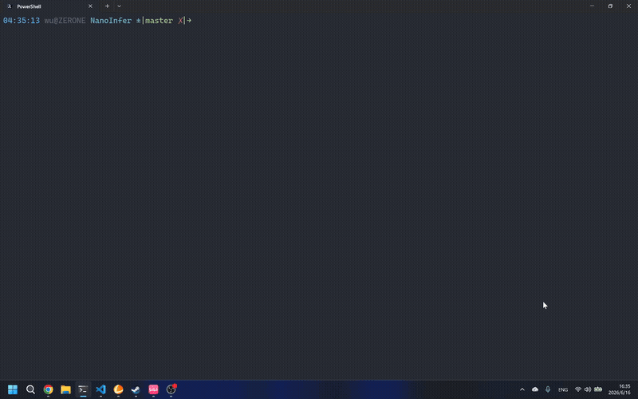

# NanoInfer

NanoInfer is a lightweight large language model inference framework written in C++17 and CUDA. It implements most of the operators required by `Llama-3.2-1B-Instruct` directly in CUDA, including token embedding, RMSNorm, RoPE, KV cache updates, grouped-query attention (GQA), causal softmax, SwiGLU, residual addition.



## Current Scope

- Model: `meta-llama/Llama-3.2-1B-Instruct`
- Weight format: Hugging Face SafeTensors
- Inference mode: single-batch interactive chat with greedy decoding
- Maximum context length: 4096 tokens
- Data type: BF16 weights and intermediate tensors; FP32 is used where required by kernels or cuBLAS paths

## Roadmap

### P0

- [x] Single-batch inference for Llama-3.2-1B-Instruct: SafeTensors weight loading, BF16 CUDA kernels, KV cache, and greedy decoding
- [ ] Correctness validation: kernel unit tests and output alignment against PyTorch/Hugging Face
- [ ] Benchmarking and profiling: report TTFT, decode tokens/s, memory usage, and Nsight Compute hotspots

### P1

- [ ] Batched prefill and batched decode
- [ ] Continuous batching: dynamically add and remove requests with different prompt and generation lengths
- [ ] KV cache management: evolve from a static contiguous cache to a paged/block-based KV cache
- [ ] HTTP/gRPC demo server: expose a simple OpenAI-compatible chat/completions API

### P2

- [ ] Decode attention kernel optimization: reduce synchronization and global memory traffic, with before/after profiling results
- [ ] Prefill attention optimization: replace the current per-head dense attention implementation
- [ ] Kernel fusion: fuse hot paths such as RMSNorm, residual addition, and SwiGLU
- [ ] CUDA Graph and stream optimization: reduce decode-step launch overhead

### P3

- [ ] Configuration-driven loading of Llama-family model parameters to reduce hard-coded assumptions
- [ ] Support for additional Llama variants and similar architectures such as Qwen or Mistral
- [ ] Weight-only INT8/INT4 quantized inference

## Usage

### Build

1. Install the Python dependencies:

```sh
python3 -m pip install -r python/requirements.txt
```

2. Configure and build the project:

```sh
cmake -S . -B build-release -DCMAKE_BUILD_TYPE=Release
cmake --build build-release
```

### Prepare Model Weights

NanoInfer currently supports only [Llama-3.2-1B-Instruct](https://huggingface.co/meta-llama/Llama-3.2-1B-Instruct). Support for additional models will be added later.

To obtain the model weights, visit the model's [Hugging Face page](https://huggingface.co/meta-llama/Llama-3.2-1B-Instruct), request access, and download the weights after access is granted:

```sh
hf download meta-llama/Llama-3.2-1B-Instruct model.safetensors --local-dir model_weights
```

### Run

```sh
./build-release/nano_infer --weights model_weights/model.safetensors
```

## References

This project was inspired by [jmaczan/tiny-vllm](https://github.com/jmaczan/tiny-vllm).
